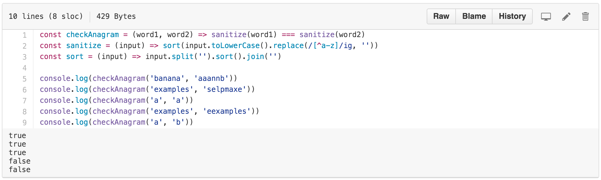
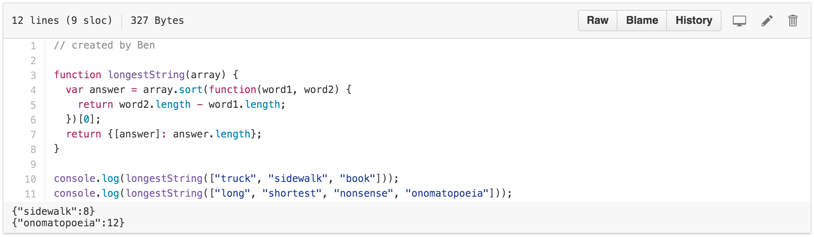

# Daily Programmer Solution Runner

Runs solutions to [Daily Programmer](https://github.com/gSchool/DailyProgrammer) Challenges when on a solution page on github.

# Install

Install this userscript with a userscript manager of your choice.

I use [tampermonkey](https://chrome.google.com/webstore/detail/tampermonkey/dhdgffkkebhmkfjojejmpbldmpobfkfo)

# Examples

